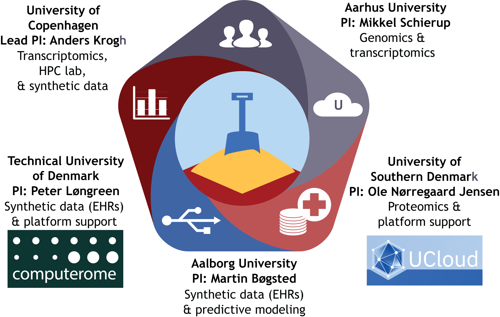

**An infrastructure project for health data science training and research in Denmark**

The National Health Data Science Sandbox project kicked off in 2021 with 5 years of funding via the Data Science Research Infrastructure initiative from the Novo Nordisk Foundation. Health data science experts at five Danish universities are contributing to the Sandbox with coordination from the Center for Health Data Science under lead PI Professor Anders Krogh. [Data scientists](../contact/contact.qmd) hosted in the research groups of each PI are building infrastructure and training modules on Computerome and UCloud, the primary academic high performance computing (HPC) platforms in Denmark. 

{fig-align="center" width="60%"}

Our computational 'sandbox' allows data scientists to explore datasets, tools and analysis pipelines in the same high performance computing environments where real research projects are conducted. Rather than a single, hefty environment, we're deploying modularized topical environments tailored for independent use on each HPC platform. We aim to support three key user groups based at Danish universities:
 
- trainees: use our training modules to learn analysis techniques with some guidance and guardrails - for your data type of interest AND for general good practices for HPC environments     
- researchers: prototype your tools and algorithms with an array of good quality datasets that are GDPR compliant and free to access
- educators: develop your next course with computational assignments in the HPC environment your students will use for their research

Activity developing independent training modules and hosting workshops has centered on UCloud, while collaborative construction of a flexible Course Platform has been completed on Computerome for use by the Sandbox and independent educators. Publicly sourced datasets are being used in training modules on UCloud, while generation of synthetic data is an ongoing project at Computerome. Sandbox resources are under active construction, so check out our other pages for the current status on [HPC Access](../access/index.qmd), [Datasets](../datasets/datapolicy.qmd), and [Modules](../modules/index.qmd). We run workshops using completed training modules on a regular basis and provide active support for Sandbox-hosted courses through a slack workspace. See our [Contact](../contact/contact.qmd) page for more information.

---

# Partner with the Sandbox

The Sandbox welcomes proposals for new courses, modules, and prototyping projects from researchers and educators. We'd like to partner with lecturers engaged with us in developing needed materials collaboratively - we would love to have input from subject experts or help promote exciting new tools and analysis methods via modules! Please contact us with your ideas at [nhds_sandbox@sund.ku.dk](mailto:nhds_sandbox@sund.ku.dk).

---

**We thank the Novo Nordisk Foundation for funding support. If you use the Sandbox for research or reference it in text or presentations, please acknowledge the Health Data Science Sandbox project and its funder the Novo Nordisk Foundation (grant number NNF20OC0063268).**

# Contact the sandbox team

The Health Data Science Sandbox is coordinated by the [Center for Health Data Science](https://heads.ku.dk/)
at the University of Copenhagen (KU).  Sandbox data scientists are also placed in collaborating groups at
the Technical University of Denmark (DTU), University of Southern Denmark (SDU), Aarhus University (AU),
and Aalborg University (AAU).

To get in touch with the Sandbox or be connected with Sandbox staff at your university,
please [email us](mailto:nhds_sandbox@sund.ku.dk). To obtain module material for use in your
own compute environment, see our GitHub organization page
at [hds-sandbox](https://github.com/hds-sandbox/).

We appreciate the contributions of previous team members José Alejandro Romero Herrera (KU), Conor O'Hare (KU), Sander Boisen Valentin (AAU) and Peter Husen (SDU).

You can find all the team members and their contacts below:
