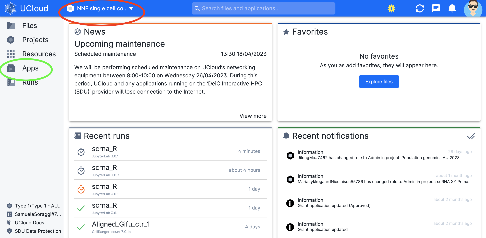
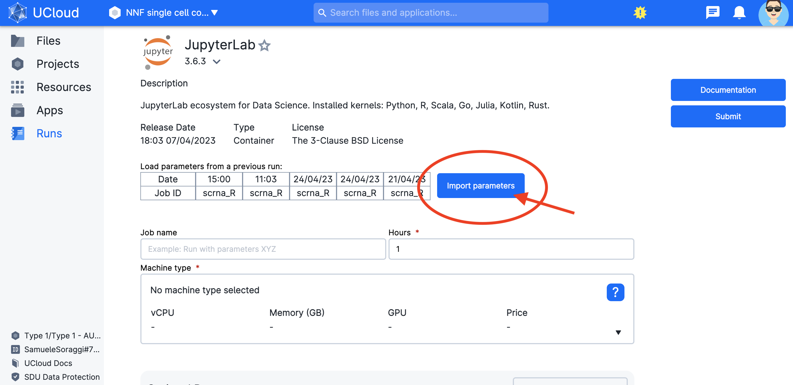
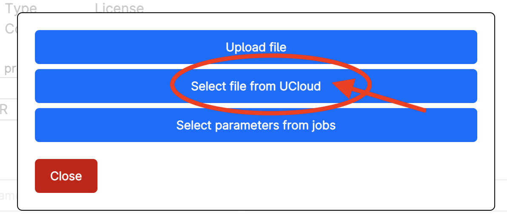
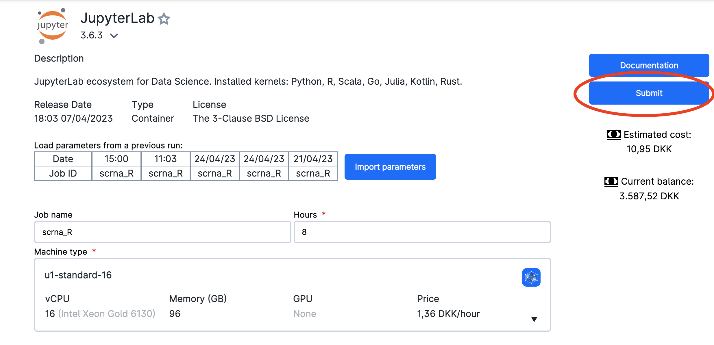

# Accessing the Sandbox on UCloud

User accounts on UCloud are enabled by university login credentials using WAYF (Where Are You From). Access the WAYF login portal [here](https://cloud.sdu.dk/), and then find your affiliated Danish university using the search bar. After login, we suggest setting up Two Factor Authentication by clicking on the icon in the top-right corner of the screen. Once you are an approved user of UCloud, you can access the Sandbox environment via different 'Sandbox' apps linked to topical modules that you deploy using your own storage and computing resources - just go to Apps once you have signed into UCloud and search 'Sandbox' to find what we have deployed. Each app page has its own Documentation link that will direct you to Sandbox-based usage guidelines which may be customized to the app's particular tools and scope. Apps will have different 'courses' that you can initially choose which make a personal copy of training materials in your workspace for you to edit.  

Each Danish university has its own usage relationship with UCloud as governed by their local front office of [DeiC](https://www.deic.dk/en) - check with your university IT support / DeiC representatives about requesting computational resources. For example, the University of Copenhagen has previously allotted an initial chunk of free UCloud compute hours to staff (from PhD students to professors as well as non-academic staff). If you have further questions about getting compute resources, please [contact](https://hds-sandbox.github.io/contact) Sandbox staff.

Extensive documentation on general use of UCloud (how to use apps and run jobs, etc.) is available in the UCloud [user guide](https://docs.cloud.sdu.dk/).

## Example: accessing course materials using JupyterLab

* Log onto UCloud at the address [http://cloud.sdu.dk](http://cloud.sdu.dk) using the university credentials.

* When you are logged in, be sure to choose the project for the NNF course (red circle). Then click on the Apps button (green circle).

* Find the app `Jupyterlab` (red circle), which is under the title `Featured`.

* Click on the app button. You will get into the settings window. Load the application settings following the illustrations below.

* Now, click on the button `Submit` (red circle).

* Wait to go through the queue. When the session starts, the timer begins to count down (red circle). In a couple of minutes you should be able to open the interface through the button (green circle).

