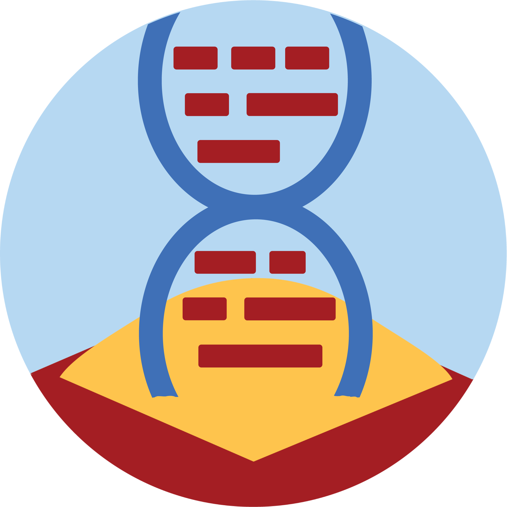
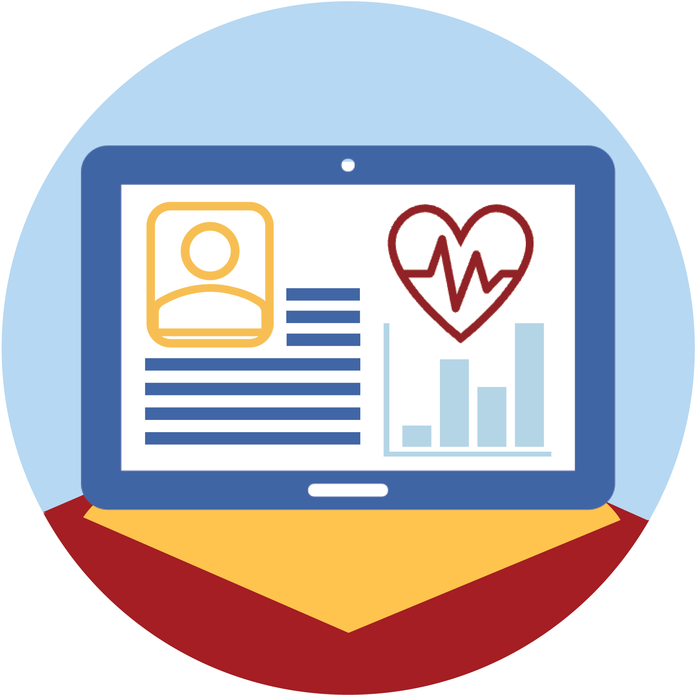
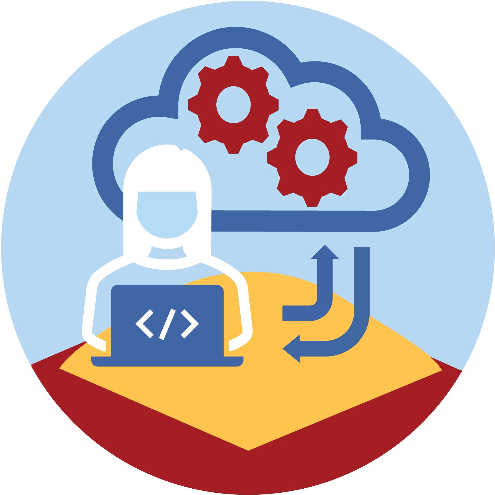

# Modules

Sandbox resources have been organized as training modules focused on key topics in health data science. We regularly host in-person workshops and support courses at host universities for students and researchers (check [News](https://hds-sandbox.github.io/news/). These tutorials and tools have also been implemented on [UCloud](cloud.sdu.dk), the academic HPC at Southern Denmark University, via a collection of Sandbox Apps where trainees who can access UCloud via WAYF can also independently use the training module materials. Training resources are also made available for use on other platforms via our [GitHub page](https://github.com/hds-sandbox). Feel free to adapt these resources for your own purposes (with credit to the National Health Data Science Sandbox project and other projects they acknowledge in the specific materials). 

Available resources within each training module are listed below, including **tutorials/guides (:octicons-code-review-24:)** and **popular tools for analysis and visualization (:octicons-tools-24:)**. [Email us]() with any questions, comments or suggestions for new workshops!
 
## Genomics 
{ align=right width="30%" } Genomics is the study of genomes, the complete set of an organism's DNA. Genomics research now encompasses functional and structural studies, epigenomics, and metagenomics, and genomic medicine is under active implementation and extension in the health sector. 

#### Use the [Genomics Sandbox App](https://cloud.sdu.dk/app/jobs/create?app=genomics&version=2023.03.01) on UCloud to explore the resources below: 
 
+ [:octicons-code-review-24: Introduction to Next Generation Sequencing data](https://hds-sandbox.github.io/NGS_summer_course_Aarhus/) (last update: June 2023)
+ [:octicons-code-review-24: Introduction to Population Genomics]() (implementation of a course by Prof. Kasper Munch of Aarhus University) (last update: March 2023)
+ [:octicons-code-review-24: Introduction to GWAS](https://hds-sandbox.github.io/) (last update: May 2023)
+ :octicons-tools-24: Interactive Genomic Browser (a popular visualization tools for genomics analysis)
>

## Transcriptomics  
{ align=right width="30%" } Transcriptomics is the study of transcriptomes, which investigates RNA transcripts within a cell or tissue to determine what genes are being expressed and in what proportion. These RNA transcripts include mRNAs, tRNA, rRNA and other non-coding RNA presents in a cell. 

#### Use the [Transcriptomics Sandbox App](https://cloud.sdu.dk/app/jobs/create?app=transcriptomics&version=2023.03) on UCloud to explore these resources:

+ [:octicons-code-review-24: Bulk RNAseq](https://hds-sandbox.github.io/bulk_RNAseq_course) (last update: June 2023) 
+ [:octicons-code-review-24: Single-Cell RNAseq](https://hds-sandbox.github.io/scRNASeq_course/) (last update: May 2023) 
+ :octicons-tools-24: Cirrocumulus (a popular tool for visualizing different types of RNA-seq data and downstream analysis)
+ :octicons-tools-24: RNAseq in RStudio (RStudio session with pre-installed RNAseq analysis packages for exploring with your own uploaded data)

## Proteomics   
{ align=right width="30%" }  Proteomics is the study of proteins that are produced by an organism. Proteomics allows us to analyse protein compositon and structure, which have great importance in determining their function.

#### Use the [Proteomics Sandbox App](https://cloud.sdu.dk/app/jobs/create?app=proteomics&version=Mar2023) on UCloud to explore pre-installed tools for proteomics analysis and other resources: 

+ [:octicons-tools-24: Proteomics Sandbox Documentation](https://hds-sandbox.github.io/proteomics-sandbox/index.html) (last update: May 2023)
+ :octicons-code-review-24: Introduction to Clinical Proteomics (course under development)

We also offer a tutorial on UCloud's [ColabFold app](https://cloud.sdu.dk/app/jobs/create?app=colabfold&version=1.5.2), a tool that allows predictions with AlphaFold2 or RoseTTAFold.

+ [:octicons-code-review-24: ColabFold Intro](https://hds-sandbox.github.io/proteomics-sandbox/colabfold.html) (last update: October 2022) 
 

## Electronic Health Records  
{ align=right width="30%" } Electronic health records (EHRs) are digital records kept in the public health sector that record the medical histories of individuals, and access is normally highly restricted to preserve patient privacy. This data is sometimes also shared (partly or in full) in secondary patient registries that support research of a specific disease or condition (such as breast cancer or cystic fibrosis). These datasets are extraordinarily valuable in the development of predictive models used in precision medicine.

The chronic lymphocytic leukemia synthetic dataset listed below is generated solely from public data and is of low utility, so we don't recommend its use beyond the course it was designed for (with much explanation for the students on its construction and caveats). Please see [Synthetic Data](https://hds-sandbox.github.io/syntheticdata/) for more information.

+ :octicons-tools-24: Chronic Lymphocytic Leukemia synthetic dataset created for use in "Fra realworld data til personlig medicin", a course from University of Copenhagen's [MS in Personlig Medicin](https://personligmedicin.ku.dk/) (last update: January 2023)
+ :octicons-code-review-24: Intro to EHR analysis (workshop under development) 
 
## HPC Lab  
{ align=right width="30%" } Advanced computing skills are a foundational skill for use of the above training modules. We aim to provide tutorials that allow the use of standard programming languages for health data science (R and Python) but additional skills in Linux/bash will likely be necessary in any health data scientist's career. Additional knowledge such as the use of version control (git and GitHub) and how to efficiently leverage high performance computing (HPC) resources provided by a local cluster, an academic supercomputer such as Computerome or UCloud, and commercial cloud computing is also of value.

+ [:octicons-code-review-24: HPC Startup Guide](https://hds-sandbox.github.io/access/index.html) (instructions for accessing and navigating compute resources at Computerome and UCloud)
+ [:octicons-code-review-24: HeaDS DataLab workshop materials](https://center-for-health-data-science.github.io/index.html) (workshops for programming and good practices developed by the Center for Health Data Science at University of Copenhagen, which are sometimes co-taught by Sandbox staff! Includes **R**, **python**, **bash**, and **git**!)
+ :octicons-code-review-24: Intro to HPC (workshop under development)

