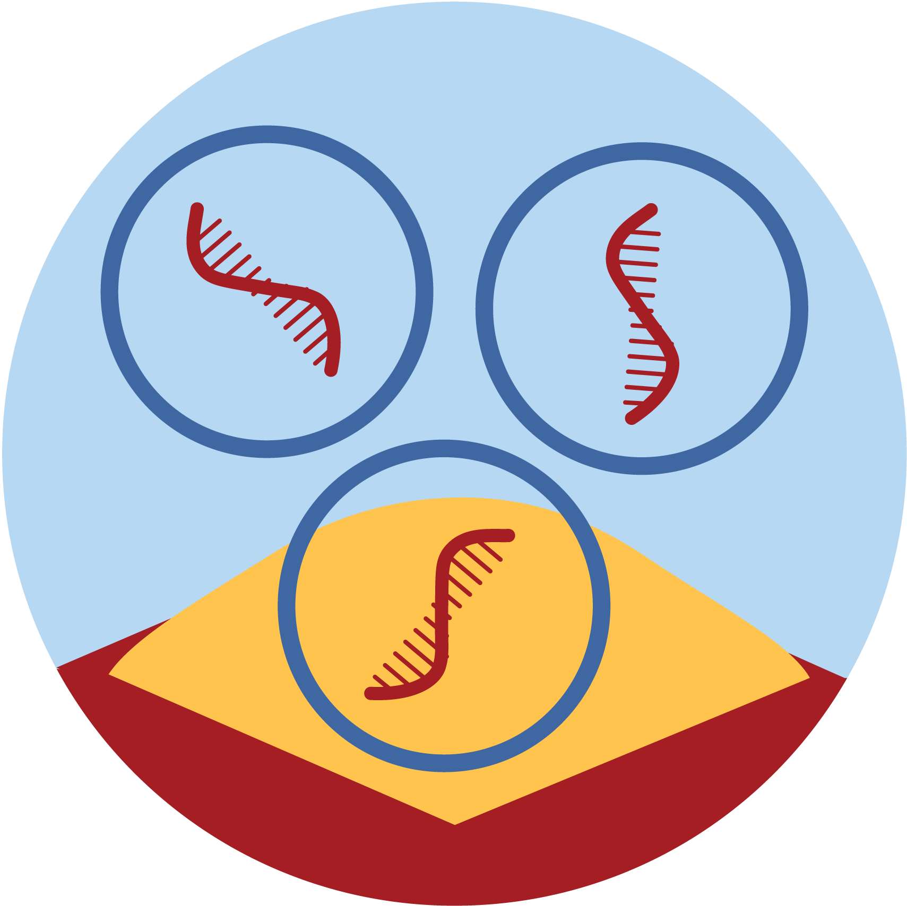

<h1 align=center style="margin:0px">Sandbox Workshop</h1>
<h3 align=center style="margin:0px">Autumn 2023</h3>

<h4 align=center>Welcome to the homepage for in-person workshops introducing the Health Data Science Sandbox to potential users. Thanks for joining us!</h4> 

!!! info "Upcoming Workshop at AAU"
    <b> Intro to the Health Data Science Sandbox at Aalborg University</b>

    Interested in adding new analysis techniques to your health data science skill set? Curious about how to use Danish supercomputing resources? Looking for how to host coding material for your own course as an academic educator? Join our workshop for a demo of the Health Data Science Sandbox, a platform for training and research being built collaboratively across 5 universities. We will introduce our mission, network, and resources and then give you an opportunity to try out our omics-focused training module with single cell RNA sequencing data in a guided live session on UCloud (experience with R is a plus but not required). The workshop is open for students, researchers, and educators. 
    
    - Instructors: Sandbox Data Scientists Jakob Skelmose (AAU CLINDA) and Samuele Soraggi (AU BiRC)
    - Time: 6 December 2023, 1200-1600
    - Location: SLV249 moedelokale 11.01.032 at AAU SUND
    - Prerequisites: anyone can join for the first hour to hear about Sandbox resources, how to use them, and plans for the future. Some experience with R or Python will help you if you join the following transcriptomics app demo for the rest of the session (but all are welcome).
    - [Sign up](https://www.moodle.aau.dk/course/view.php?id=50047) on AAU's Moodle or [email the Sandbox](mailto:nhds_sandbox@sund.ku.dk) with questions

<h2>Agenda</h2>
 1. The Sandbox Concept - 30 minutes
 2. Accessing Sandbox resources - 10 minutes
 3. Try out our transcriptomics module - 2 hours
 4. Discussion and feedback - 20 minutes

## The Sandbox concept
The Health Data Science Sandbox aims to be a training resource for bioinformaticians, data scientists, and those generally curious about how to investigate large biomedical datasets. We are an active and developing project seeking interested users (both trainees and educators). All of our open-source materials are available on our [Github page](https://github.com/hds-sandbox) and much more information is available on the rest of the website you are currently visiting! We work with both UCloud and Computerome (major Danish academic supercomputers) - see our [HPC Access page](https://hds-sandbox.github.io/access/index.html) for more info on each set up.

## Access Sandbox resources
We currently provide training materials and resources as topical apps on UCloud, the supercomputer located at the University of Southern Denmark. To use these resources, you'll need the following:

 1. a Danish university ID so you can sign on to UCloud via WAYF. See [this guide](https://hds-sandbox.github.io/access/UCloud.html) and/or follow along with our live demo.
 2.  the ability to navigate in linux / RStudio / Jupyter. You don't need to be an expert, but it is beyond our ambitions (and course material) to teach you how to code and how to run analyses simultaneously. We recommend a basic R or Python course before diving in.
 3. our invite link to the correct UCloud project that will be shared on the day of the workshop. This way, we can provide you compute resources for the active sessions of the workshop. To use Sandbox materials outside of the workshop, you'll need to check with the local DeiC office at your university about how to request compute hours on UCloud.

## Try out a module
So our Sandbox data scientists have finished their intro at the workshop? Great, now the brave ones in the audience can try out one of our apps in a live session. Today we are demoing:

{ align=left width="10%" }
### Transcriptomics 
If you're interested in bulk or single cell RNA sequencing analysis and visualization, join Sandbox Data Scientist Samuele Soraggi from Aarhus University in testing out our Transcriptomics Sandbox app. This app supports regular 3-4 day workshops at University of Copenhagen and provides stand-alone visualisation tools. Sign into UCloud and then click this [invite link](not active yet).

## Discussion and feedback
We hope you enjoyed the live demo. If you have broader questions, suggestions, or concerns, now is the time to raise them! If you are totally toast for the day, remember that you can check out longer versions of our tutorials as well as other topics and tools in each of the [Sandbox modules](https://hds-sandbox.github.io/modules/index.html) or join us for a multi-day in person [course](https://hds-sandbox.github.io/news/news.html).

As data scientists, we also would be really happy for some quantifiable info and feedback - we want to build things that the Danish health data science community is excited to use. <b>Please answer these [5 questions](survey link) for us before you head out for the day</b>  (*link activated on day of the workshop*).

<h2 align=center style="margin:0px">Nice meeting you and we hope to see you again!</h2>

